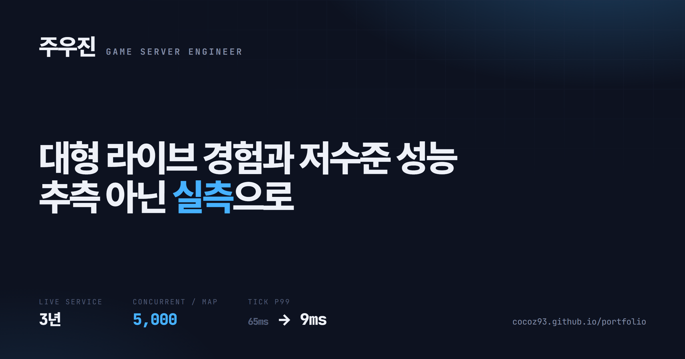
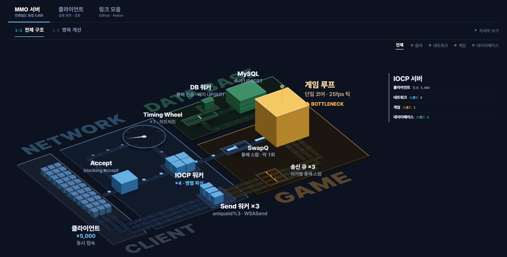

# 주우진 · Game Server Engineer — Portfolio

**C++ 게임 서버 엔지니어 포트폴리오입니다.**

Windows·Linux 라이브 3년 · 라그나로크 · 던전앤파이터 · 신규 MMO 설계
개인 R&D · 맵당 동접 ~5,000 · tick p99 65 → 9ms · **채택도 기각도 A/B 실측**

## 🔗 바로가기
- 🌐 **포트폴리오** — https://cocoz93.github.io/portfolio/
- 🏭 **MMO 서버 구조·병목 투어** — https://cocoz93.github.io/portfolio/mmo-site/
- 🍀 **기술경력서** — [Notion 바로가기](https://feline-vacation-d6d.notion.site/23316a0b9f59809db2e5d610a23a10a5)
- 📚 **DEV LOG 26** — [노션 블로그 전체](https://feline-vacation-d6d.notion.site/DEV-LOG-26-2db16a0b9f598196a471d53775ab4223)
- 📧 **Email** — wndnwls7@gmail.com

## 🏭 MMO 서버 구조

실험 16건으로 병목을 하나씩 옮겨 맵당 동접 ~5,000.

## 📂 함께 보는 저장소
| 저장소 | 내용 |
|--------|------|
| [MMO_Zone](https://github.com/cocoz93/MMO_Zone) | Windows IOCP MMO 게임서버 — 동접 200 → ~5,000 병목 추적 |
| [ServerCore](https://github.com/cocoz93/ServerCore) | 계층 분리된 C++17 서버 코어 — IOCP · RIO · epoll |
| [LockFree](https://github.com/cocoz93/LockFree) | 락프리 큐·스택 + 2계층 메모리풀 |
